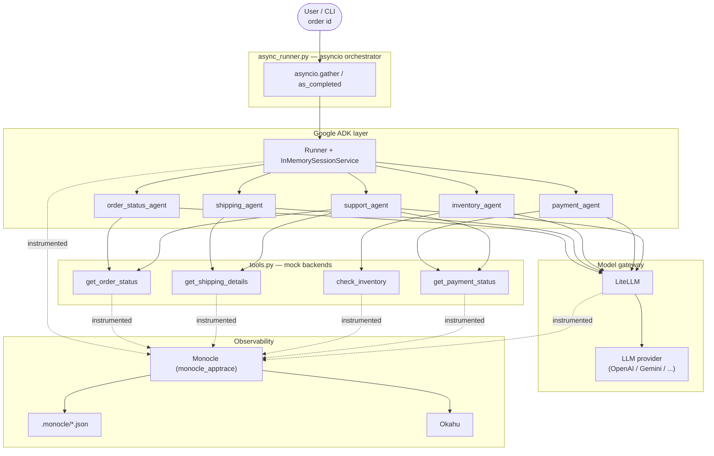
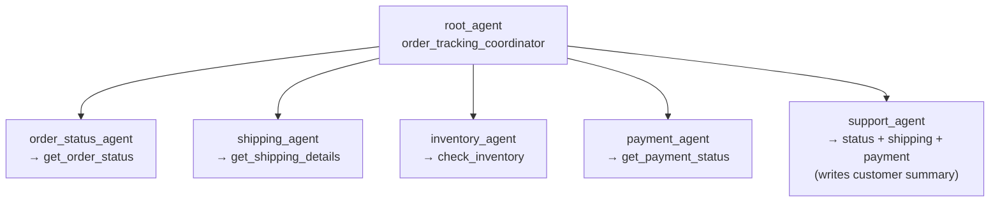
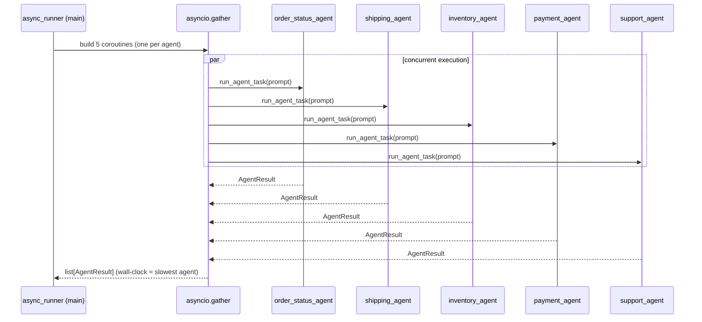
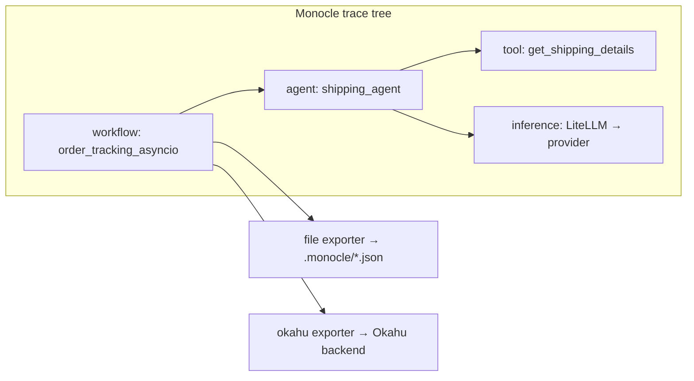
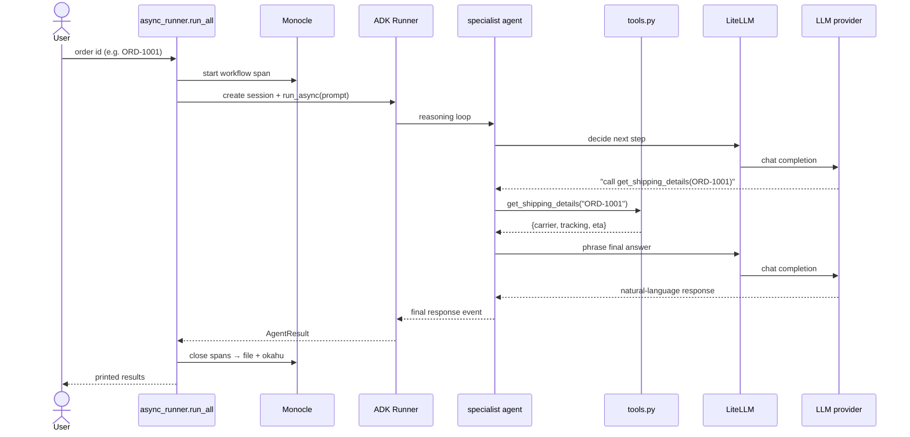
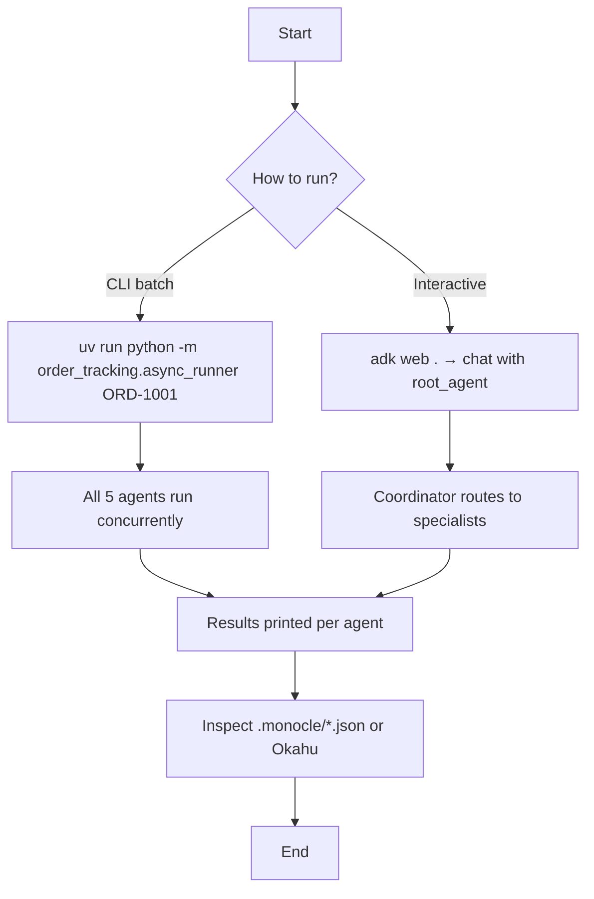
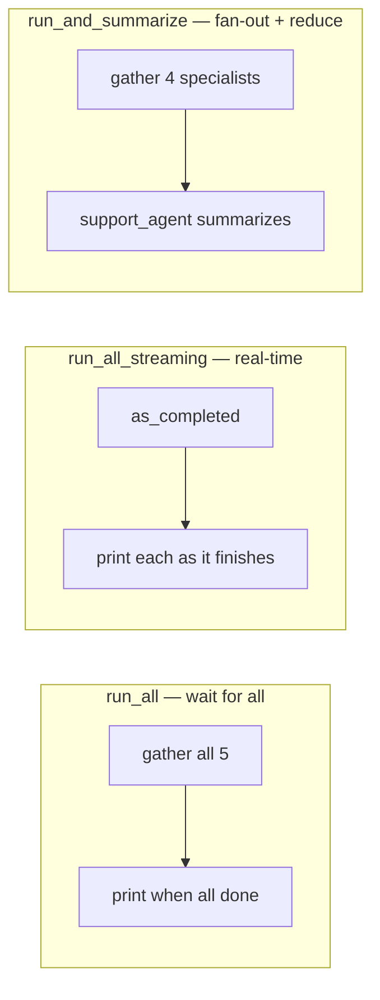

# Order Tracking — Async Multi-Agent Demo (Google ADK + asyncio + LiteLLM + Monocle)

An end-to-end, production-shaped example that shows how to run **multiple
independent AI agents concurrently** using Python `asyncio` and **Google's Agent
Development Kit (ADK)**. Each agent is a domain specialist (order status,
shipping, inventory, payment, support) backed by an LLM through **LiteLLM**, and
the entire run is instrumented with **Monocle** (`monocle_apptrace`) so every
agent, tool call, and LLM request is captured as a distributed trace and shipped
to file + **Okahu** for observability.

> TL;DR: five specialist agents answer a single order question *at the same
> time*. Total wall-clock time ≈ the slowest agent, not the sum of all five.

---

## Table of contents

- [Why this project exists](#why-this-project-exists)
- [Tech stack](#tech-stack)
- [Repository layout](#repository-layout)
- [System architecture](#system-architecture)
- [Agent topology](#agent-topology)
- [Concurrency model](#concurrency-model)
- [Observability with Monocle + Okahu](#observability-with-monocle--okahu)
- [End-to-end request flow](#end-to-end-request-flow)
- [User flow](#user-flow)
- [Data model (mock backends)](#data-model-mock-backends)
- [Setup](#setup)
- [Configuration](#configuration)
- [Running the demo](#running-the-demo)
- [Three orchestration patterns](#three-orchestration-patterns)
- [End-to-end example walkthrough](#end-to-end-example-walkthrough)
- [Extending the project](#extending-the-project)
- [Troubleshooting](#troubleshooting)

---

## Why this project exists

Most agent tutorials call one LLM at a time, sequentially. Real order-tracking
needs answers from several independent systems (OMS, carrier API, warehouse,
payment gateway) and there is no reason to wait for them one after another.

This repo demonstrates the **"many at once"** pattern:

- Each system is modeled as an **independent ADK `Agent`** with its own tools.
- All agents are launched concurrently with `asyncio.gather`.
- A coordinator/support agent can optionally **fan-out then summarize**.
- Every step is **traced** end-to-end for debugging and evaluation.

---

## Tech stack

| Layer | Technology | Role |
|-------|-----------|------|
| Orchestration | **Python `asyncio`** | Run agents concurrently (`gather`, `as_completed`) |
| Agent framework | **Google ADK** (`google-adk`, `google-adk[a2a]`) | `Agent`, `Runner`, `InMemorySessionService` |
| Model gateway | **LiteLLM** (`google.adk.models.lite_llm.LiteLlm`) | One interface to OpenAI / Gemini / Anthropic / etc. |
| Content types | **google-genai** | `types.Content` / `types.Part` message construction |
| Tooling protocol | **MCP** (`mcp`) | Tool/transport plumbing used by ADK |
| Observability | **Monocle** (`monocle_apptrace`) + **Okahu** | Auto-instrumented traces of agents, tools, LLM calls |
| Packaging / runner | **uv** + **hatchling** | Env management, `track-order` console script |

---

## Repository layout

```
order_tracking_asyncio/
├── pyproject.toml              # Deps (ADK, LiteLLM, genai, mcp, monocle), build, scripts
├── uv.lock                     # Locked dependency graph
├── README.md                   # This file
├── .gitignore                  # Ignores .env, .venv, caches, build artifacts
├── .github/
│   └── instructions/
│       └── okahu.instructions.md   # Okahu MCP routing hints for trace/eval queries
├── .monocle/                   # Monocle trace output (JSON spans) written at runtime
└── order_tracking/
    ├── __init__.py             # Public exports (root_agent, agents, ORDER_AGENTS)
    ├── agent.py                # 5 specialist agents + root coordinator (LiteLLM)
    ├── tools.py                # Mock OMS/WMS/carrier/payment tools (deterministic)
    ├── async_runner.py         # asyncio orchestration + Monocle setup + CLI entrypoint
    └── .env.example            # Model + provider credentials template
```

---

## System architecture



**Key idea:** the orchestrator never blocks on a single agent. ADK runs each
agent's reasoning loop; the agent decides to call a tool; the tool returns
deterministic mock data; the agent uses the LLM (via LiteLLM) to phrase the
answer. Monocle wraps all of it transparently.

---

## Agent topology

There are **five specialist agents** plus a **root coordinator** (used for
`adk web .` interactive testing).



| Agent | Responsibility | Tools |
|-------|----------------|-------|
| `order_status_agent` | Fulfilment status, placed date, items | `get_order_status` |
| `shipping_agent` | Carrier, tracking number, ETA | `get_shipping_details` |
| `inventory_agent` | On-hand stock + reorder flag per SKU | `check_inventory` |
| `payment_agent` | Auth/capture/failed, amount, currency | `get_payment_status` |
| `support_agent` | Friendly customer-facing summary | `get_order_status`, `get_shipping_details`, `get_payment_status` |

All agents are collected in `ORDER_AGENTS` for the concurrent runner. Models are
configured through **LiteLLM**: `model=LiteLlm(model=os.getenv("SHIPPING_MODEL", "gpt-4o"))`,
so you can point every agent at any provider supported by LiteLLM.

---

## Concurrency model



Each task gets a **distinct `session_id`** so concurrent agents never collide on
ADK session state. `asyncio.gather(..., return_exceptions=True)` ensures one
failing agent does not abort the whole batch — its error is captured into that
agent's `AgentResult`.

---

## Observability with Monocle + Okahu

Monocle is initialized at import time in `async_runner.py`, before agents run:

```python
from monocle_apptrace import setup_monocle_telemetry

setup_monocle_telemetry(
    workflow_name="order_tracking_asyncio",
    monocle_exporters_list="file,okahu",
)
```

What you get automatically (no manual span code):

- **Workflow span** for the whole run (`order_tracking_asyncio`).
- **Agent spans** for each ADK agent invocation.
- **Tool spans** for `get_order_status`, `get_shipping_details`, etc.
- **Inference spans** for each LiteLLM/LLM call (model, tokens, latency).



- **`file` exporter** writes spans to `.monocle/monocle_trace_*.json` (handy for
  local debugging and diffing runs).
- **`okahu` exporter** ships traces to Okahu for search, workflow grouping, and
  evaluation. Routing hints live in
  [.github/instructions/okahu.instructions.md](.github/instructions/okahu.instructions.md).

---

## End-to-end request flow



---

## User flow



---

## Data model (mock backends)

`tools.py` ships deterministic mock data so runs and evaluations are
reproducible. Three orders and three SKUs are seeded:

| Order | Status | Carrier | Tracking |
|-------|--------|---------|----------|
| `ORD-1001` | shipped | UPS | tracking number present |
| `ORD-1002` | processing | — | not yet shipped |
| `ORD-1003` | delivered | FedEx | tracking number present |

| SKU | Stock state |
|-----|-------------|
| `SKU-APL-01` | in stock |
| `SKU-KBD-07` | low (reorder) |
| `SKU-MON-22` | out of stock |

Each tool returns a `{"status": "success" | "error", ...}` dict, so agents can
gracefully report missing orders/SKUs.

---

## Setup

Prerequisites: **Python ≥ 3.10** and **[uv](https://docs.astral.sh/uv/)**.

```bash
# 1. Install dependencies into a local .venv
uv sync

# 2. Create your env file from the template
cp order_tracking/.env.example order_tracking/.env
# then edit order_tracking/.env and add your provider key
```

---

## Configuration

Models are resolved through LiteLLM. The default model id comes from the
`SHIPPING_MODEL` environment variable (falls back to `gpt-4o`):

```python
model_name = os.getenv("SHIPPING_MODEL", "gpt-4o")
# every agent: model=LiteLlm(model=model_name)
```

`order_tracking/.env.example` covers the common providers:

```dotenv
# --- LiteLLM model selection ---
SHIPPING_MODEL=gpt-4o            # any LiteLLM-supported model id

# --- OpenAI (default model is gpt-4o) ---
OPENAI_API_KEY=your-openai-key

# --- Google ADK / Gemini (AI Studio) ---
GOOGLE_GENAI_USE_VERTEXAI=False
GOOGLE_API_KEY=your-ai-studio-api-key

# --- Google Vertex AI (production) ---
# GOOGLE_GENAI_USE_VERTEXAI=True
# GOOGLE_CLOUD_PROJECT=your-gcp-project
# GOOGLE_CLOUD_LOCATION=global
```

> Pick the credentials that match your `SHIPPING_MODEL`. If you set
> `SHIPPING_MODEL=gemini/gemini-2.0-flash`, supply Google creds instead of
> `OPENAI_API_KEY`.

---

## Running the demo

```bash
# Default order (ORD-1001)
uv run python -m order_tracking.async_runner

# Specific order
uv run python -m order_tracking.async_runner ORD-1002

# Direct script path also works (import fallback handles both)
uv run order_tracking/async_runner.py ORD-1003

# Installed console script
uv run track-order ORD-1001
```

Interactive mode (chat with the coordinator agent):

```bash
uv run adk web .
```

Traces appear in `.monocle/` after each run and are pushed to Okahu via the
`okahu` exporter.

---

## Three orchestration patterns

`async_runner.py` ships three reusable patterns:



| Function | Pattern | Use when |
|----------|---------|----------|
| `run_all(order_id)` | `asyncio.gather` | You need every agent's full answer |
| `run_all_streaming(order_id)` | `asyncio.as_completed` | You want results streamed as they land |
| `run_and_summarize(order_id)` | fan-out → reduce | You want one friendly customer summary |

---

## End-to-end example walkthrough

Running `uv run python -m order_tracking.async_runner ORD-1001`:

1. **Monocle boots** — `setup_monocle_telemetry(...)` starts the
   `order_tracking_asyncio` workflow and registers the `file` + `okahu`
   exporters.
2. **Prompts are built** — `_prompt_for(agent_name, order_id)` produces an
   agent-specific question (status vs. shipping vs. inventory vs. payment vs.
   summary).
3. **Five coroutines launch** — `run_all` builds one `run_agent_task` per agent,
   each with its own `session_id`, and fires them with
   `asyncio.gather(..., return_exceptions=True)`.
4. **Each agent reasons + calls a tool** — e.g. `shipping_agent` calls
   `get_shipping_details("ORD-1001")` → `{carrier: UPS, tracking: ..., eta: ...}`
   and the LLM phrases it.
5. **Results collected** — wall-clock time is printed (≈ the slowest agent), and
   each agent's answer is printed under its name. Any failure shows as
   `ERROR: ...` for that agent only.
6. **Traces flushed** — span tree (workflow → agents → tools → inference) is
   written to `.monocle/*.json` and exported to Okahu.

Sample console shape:

```
Tracking order ORD-1001 across 5 agents...

--- Completed 5 agents in 2.41s ---

[order_status_agent]
Order ORD-1001 was placed recently and is currently shipped...

[shipping_agent]
Your order is on the way via UPS, ETA soon...

[inventory_agent]
SKU-APL-01: in stock, no reorder needed...

[payment_agent]
Payment captured successfully...

[support_agent]
Good news! Your order ORD-1001 shipped via UPS and should arrive soon...
```

---

## Extending the project

- **Add an agent**: define a new `Agent` in `agent.py`, add it to `ORDER_AGENTS`,
  and (optionally) wire its tool in `tools.py`.
- **Swap the model**: set `SHIPPING_MODEL` to any LiteLLM model id.
- **Real backends**: replace the mock dicts in `tools.py` with calls to your
  OMS / carrier / payment APIs — the agent and tracing layers stay unchanged.
- **Evaluation**: use the Okahu traces (workflow `order_tracking_asyncio`) to
  score tool-trajectory and response quality.

---

## Troubleshooting

| Symptom | Cause | Fix |
|---------|-------|-----|
| `Missing credentials ... OPENAI_API_KEY` | `SHIPPING_MODEL` defaults to `gpt-4o` with no key | Add `OPENAI_API_KEY` to `.env` or change `SHIPPING_MODEL` |
| `attempted relative import with no known parent package` | Ran the file as a plain script | Already handled by the import fallback; or use `python -m order_tracking.async_runner` |
| `App name mismatch detected` warning | ADK app-name heuristic vs. configured `APP_NAME` | Harmless for this demo; safe to ignore |
| No files in `.monocle/` | Run didn't reach telemetry flush | Ensure the run completes; check the `file` exporter is in `monocle_exporters_list` |
| `uv` cache permission errors | Sandboxed shell | Run in a normal terminal (cache lives under `~/.cache/uv`) |

---

Built to demonstrate **concurrent multi-agent orchestration** with Google ADK,
asyncio, LiteLLM, and first-class observability via Monocle + Okahu.